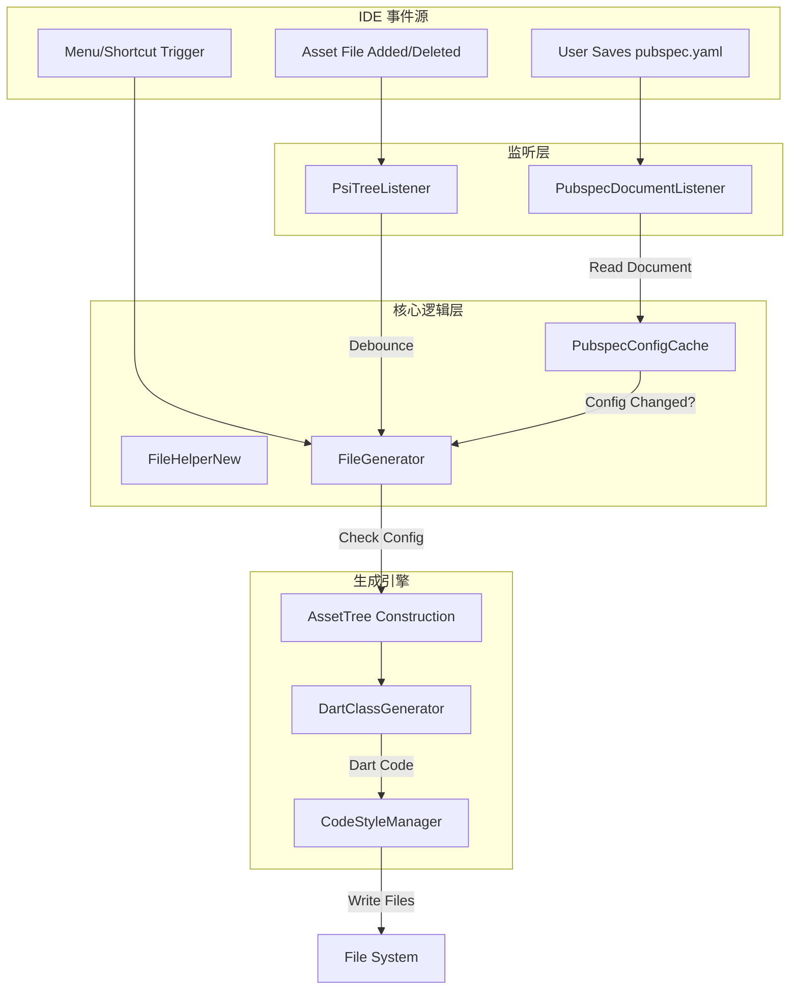
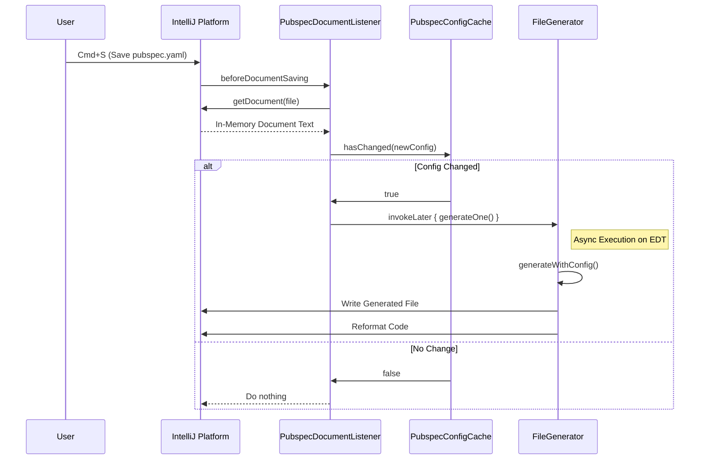

# Flutter Assets Generator 3.0.0 技术方案详述

本文档详细描述了 Flutter Assets Generator 插件 (v3.0.0) 的技术架构、核心流程与关键实现细节。

## 1. 架构概览 (Architecture Overview)

本插件采用 **事件驱动 (Event-Driven)** 架构，通过监听 IDE 及其文件系统的特定事件（Config 保存、Asset 变更），触发异步的代码生成任务。核心设计原则包括：

*   **隔离性 (Isolation)**: 多模块/多项目配置完全隔离。
*   **一致性 (Consistency)**: 优先读取内存中的 Document，确保生成内容与编辑器视图片一致。
*   **安全性 (Safety)**: 所有写操作均在 `WriteCommandAction` 中执行，并利用 `invokeLater` 避免死锁。
*   **兼容性 (Compatibility)**: 同时支持分层级 (Robust) 和扁平化 (Legacy) 两种生成风格。

### 1.1 系统架构图



## 2. 核心流程详述 (Core Processes)

### 2.1 配置文件变更响应流程 (Config Change Flow)

此流程解决了"编辑即触发"带来的性能问题和"读取旧文件"导致的数据不一致问题。



### 2.2 资源文件变更流程 (Asset Change Flow)

此流程处理图片/SVG等资源的增删改，包含防抖机制。

```mermaid
graph LR
    A[File Change Event] --> B{In Assets Dir?}
    B -- No --> C[Ignore]
    B -- Yes --> D[Reset Alarm (Debounce 300ms)]
    D --> E[Alarm Trigger]
    E --> F[Generate Code]
```

## 3. 关键类解析 (Key Class Analysis)

### 3.1 `PubspecDocumentListener.kt`
**作用**: 监听 `pubspec.yaml` 的保存动作。
**核心逻辑**:
- 使用 `FileDocumentManagerListener` 替代传统的 `PsiTreeListener`，精准捕获保存时刻。
- **关键代码**: 
    ```kotlin
    // 优先从 Document 读取内存数据，而不是 File.readText()
    val document = FileDocumentManager.getInstance().getDocument(file)
    val content = document?.text ?: ...
    ```
- **线程模型**: 使用 `ApplicationManager.getApplication().invokeLater` 将生成任务推迟到保存动作完成后，避免写锁冲突。

### 3.2 `PubspecConfigCache.kt`
**作用**: 管理配置缓存与变更检测。
**核心设计**:
- **复合键**: 使用 `ProjectLocationHash + ModulePath` 作为 Key，确保多模块环境下配置互不干扰。
- **Diff 算法**: 仅当 `assets` 路径列表、插件配置 (`classname`, `style` 等) 发生实质变化时才返回 `true`。

### 3.3 `DartClassGenerator.kt`
**作用**: 根据资源树生成 Dart 代码。
**升级点**:
- **双模式支持**:
    - `generateRobust()`: 生成分层级类 (`Assets.images.logo`)，集成 Widget 方法。
    - `generateLegacy()`: 生成扁平化常量 (`Assets.imagesLogo`)，兼容旧项目。
- **统一命名规范**: 无论哪种模式，均通过 `getSafeName()` 统一处理特殊字符（空格、括号、关键词），杜绝语法错误。

### 3.4 `FileGenerator.kt`
**作用**: 生成流程的协调者 (Orchestrator)。
**职责**:
1.  调用 `FileHelperNew` 解析配置。
2.  调用 `AssetTree` 构建资源树。
3.  检查 `pubspec.yaml` 依赖 (`flutter_svg`, `lottie`) 并自动添加。
4.  调用 `DartClassGenerator` 获取代码字符串。
5.  **核心步骤**: 写入文件并调用 `CodeStyleManager.reformat()` 执行格式化。

## 4. 设计细节 (Design Details)

### 4.1 自动依赖管理
插件不只是生成代码，还是一个"智能助手"。在扫描资源树时，如果发现 `.svg` 或 `.json` (Lottie) 文件，会置位标志 `hasSvg` / `hasLottie`。
在生成结束后，如果 `auto_detection` 开启，插件会检查 `pubspec.yaml` 的 `dependencies` 节点。如果缺少 `flutter_svg` 或 `lottie`，会自动插入依赖。

### 4.2 智能生成风格 (Robust Style)
v3.0.0 默认采用 Robust 风格，生成的类结构如下：

```dart
class Assets {
  Assets._();
  static const $AssetsImagesGen images = $AssetsImagesGen();
}

class $AssetsImagesGen {
  const $AssetsImagesGen();
  final AssetGenImage logo = const AssetGenImage('assets/images/logo.png');
}

class AssetGenImage {
  // ... 内置 .image() 方法 ...
}
```
这种设计允许用户通过 `Assets.images.logo.image()` 链式调用，极大提升了编码体验和类型安全性。

### 4.3 兼容性设计 (Compatibility)
针对老用户，通过简单的配置回退：
```yaml
flutter_assets_generator:
  style: camel_case
```
插件会切换回扁平化生成策略，但**底层依然复用 v3.0 的文件系统监听、内存读取和防抖机制**。这意味着老用户也能享受到新架构的稳定性和性能提升。

## 5. 项目结构说明

```text
src/main/java/com/crzsc/plugin/
├── actions/            # IDE 菜单动作 (Generate, Setup)
├── cache/              # 配置缓存 (PubspecConfigCache)
├── listener/           # 事件监听 (PubspecDocumentListener, PsiTreeListener)
├── utils/
│   ├── AssetTree.kt    # 资源树数据结构
│   ├── DartClassGenerator.kt # 代码生成核心逻辑
│   ├── FileGenerator.kt      # 流程控制器
│   ├── FileHelperNew.kt      # 文件/配置读取工具
│   └── ...
└── ...
```

---
*Generated by Flutter Assets Generator Team*
