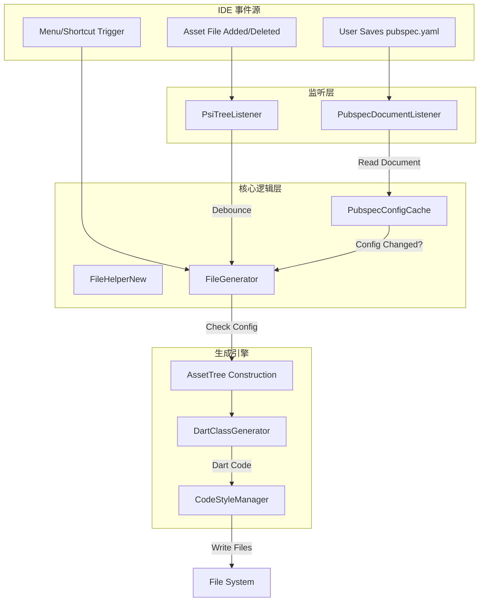
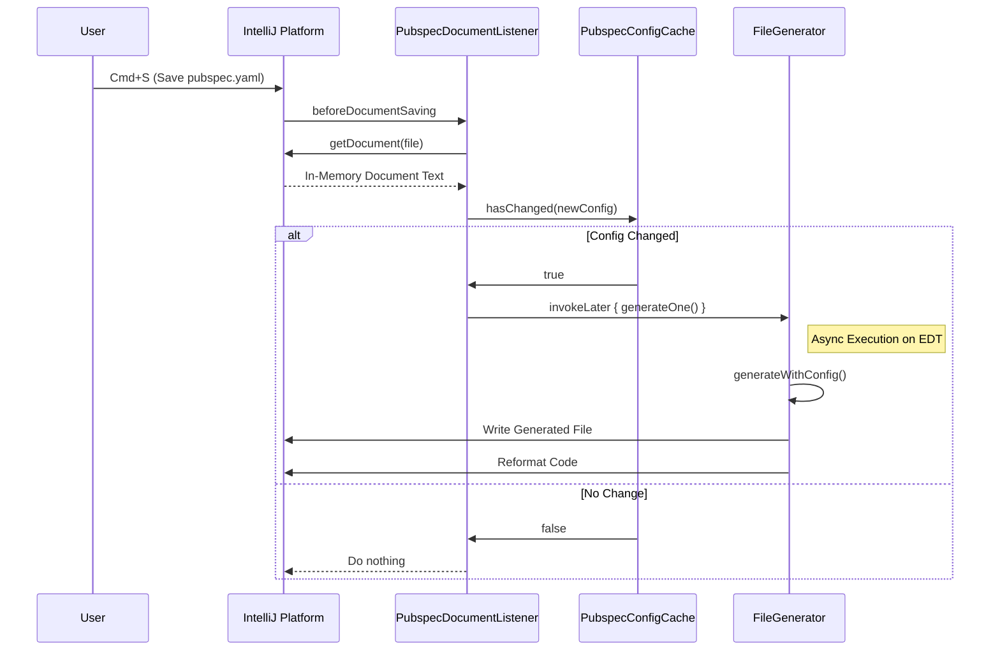

# Flutter Assets Generator 3.0.0 技术方案详述

> **文档版本**: `d485e7e` - 性能优化 (2026-02-04)  
> **最后更新**: 2026-02-04

本文档详细描述了 Flutter Assets Generator 插件 (v3.0.0) 的技术架构、核心流程与关键实现细节。

## 1. 架构概览 (Architecture Overview)

本插件采用 **事件驱动 (Event-Driven)** 架构，通过监听 IDE 及其文件系统的特定事件（Config 保存、Asset 变更），触发异步的代码生成任务。核心设计原则包括：

*   **隔离性 (Isolation)**: 多模块/多项目配置完全隔离。
*   **一致性 (Consistency)**: 优先读取内存中的 Document，确保生成内容与编辑器视图片一致。
*   **安全性 (Safety)**: 所有写操作均在 `WriteCommandAction` 中执行，并利用 `invokeLater` 避免死锁。
*   **兼容性 (Compatibility)**: 同时支持分层级 (Robust) 和扁平化 (Legacy) 两种生成风格。

### 1.1 系统架构图



## 2. 核心流程详述 (Core Processes)

### 2.1 配置文件变更响应流程 (Config Change Flow)

此流程解决了"编辑即触发"带来的性能问题和"读取旧文件"导致的数据不一致问题。



### 2.2 资源文件变更流程 (Asset Change Flow)

此流程处理图片/SVG等资源的增删改，包含防抖机制。

```mermaid
graph LR
    A[File Change Event] --> B{In Assets Dir?}
    B -- No --> C[Ignore]
    B -- Yes --> D[Reset Alarm (Debounce 300ms)]
    D --> E[Alarm Trigger]
    E --> F[Generate Code]
```

## 3. 核心类与关键代码深度解析 (Deep Dive)

### 3.1 `PubspecDocumentListener` (事件源)
**类路径**: `src/main/java/com/crzsc/plugin/listener/PubspecDocumentListener.kt`

**核心职责**: 监听 `pubspec.yaml` 的保存事件，触发防抖生成。

**关键方法**:
*   **`beforeDocumentSaving(event: DocumentEvent)`**:
    *   **触发时机**: 用户按下 Cmd+S 或 IDE 自动保存时。
    *   **逻辑**:
        1.  检查文件是否为 `pubspec.yaml`。
        2.  从 `Document` 对象直接读取内容（确保获取的是编辑器中的最新内容，而非磁盘旧内容）。
        3.  解析 YAML 并调用 `PubspecConfigCache.hasChanged(newConfig)`。
        4.  如果配置有变更，调用 `ApplicationManager.getApplication().invokeLater { fileGenerator.generateOne(module) }`。
            *   *使用 `invokeLater` 的原因*: `beforeDocumentSaving` 处于写锁等待状态，此时发起新的 WriteAction 会导致死锁或异常。推迟到 EDT 队列尾部执行是安全的。

### 3.2 `PubspecConfigCache` (配置隔离与Diff)
**类路径**: `src/main/java/com/crzsc/plugin/cache/PubspecConfigCache.kt`

**核心职责**: 缓存上一次的配置快照，并在多模块环境下隔离配置。

**关键数据结构**:
```kotlin
// Key: ProjectLocation + ModulePath (确保唯一性)
// Value: ModulePubSpecConfig (配置快照)
private val cacheMap = ConcurrentHashMap<String, ModulePubSpecConfig>()
```

**关键方法**:
*   **`hasChanged(newConfig: ModulePubSpecConfig): Boolean`**:
    *   **Diff 策略**: 不比较整个对象，而是逐字段比较关键配置：
        *   `assets` 路径列表 (长度、内容)
        *   `class_name`
        *   `output_dir`
        *   `flutter_assets_generator` 配置块的任意变更
    *   **收益**: 用户仅修改 `version` 或 `description` 时，不会触发代码重新生成。

### 3.3 `FileHelperNew` (配置解析)
**类路径**: `src/main/java/com/crzsc/plugin/utils/FileHelperNew.kt`

**核心职责**: 从 Module 中解析 `pubspec.yaml` 配置，支持内存读取。

**关键方法**:
*   **`getPubSpecConfig(module: Module)`**:
    *   **内存读取优先**:
        ```kotlin
        val document = FileDocumentManager.getInstance().getDocument(pubRoot.pubspec)
        val content = document?.text ?: String(pubRoot.pubspec.contentsToByteArray())
        ```
        这是解决“读取磁盘旧文件导致配置回滚”Bug 的核心代码。
    *   **默认值处理**: 移除了 `PluginSetting` 回退逻辑，所有配置项在未找到时返回硬编码的最佳实践默认值（SSOT 原则）。

### 3.4 `DartClassGenerator` (代码生成引擎)
**类路径**: `src/main/java/com/crzsc/plugin/utils/DartClassGenerator.kt`

**核心职责**: 将资源树转换为 Dart 代码字符串。

**关键方法**:
*   **`generate()`**: 根据 `style` 配置分发逻辑。
*   **`generateRobust()` (v3.0 默认)**:
    *   生成分层级的类结构。
    *   为每个图片资源生成 `AssetGenImage` 对象实例。
    *   集成 `.svg()` (若依赖 `flutter_svg`) 和 `.lottie()` (若依赖 `lottie`) 方法。
*   **`generateLegacy()` (兼容模式)**:
    *   生成扁平化的 `static const String` 字段。
    *   生成的变量名使用 `camelCase` 风格 (例如 `assetsImagesLogo`)。
*   **`getSafeName(name: String)` (统一命名算法)**:
    *   处理所有非法字符（空格、`-`、`@` 等）。
    *   处理 Dart 关键字冲突（如 `do`, `if` -> `kDo`, `kIf`）。
    *   **重要性**: 它是整个插件稳定性的基石，确保生成的代码永远不会有语法错误。

### 3.5 `FileGenerator` (流程编排)
**类路径**: `src/main/java/com/crzsc/plugin/utils/FileGenerator.kt`

**核心职责**: 串联配置解析、资源树构建、代码生成与文件写入。

**关键方法**:
*   **`generateOne(config: ModulePubSpecConfig)`**:
    *   **依赖注入**: 自动检查并添加 `flutter_svg` / `lottie` 依赖。
    *   **格式化**:
        ```kotlin
        // 必须在 WriteAction 中执行
        CodeStyleManager.getInstance(project).reformat(dartFile)
        ```
        恢复了被移除的自动格式化功能，保证生成的代码符合用户项目的代码风格。

### 3.6 `AssetsLineMarkerProvider` (编辑器增强)
**类路径**: `src/main/java/com/crzsc/plugin/provider/AssetsLineMarkerProvider.kt`

**核心职责**: 为 Dart 代码中的资源字符串提供行标记（Line Marker），显示资源预览图标。

**关键逻辑**:
*   **识别资源引用**: 扫描 Dart 代码中的字符串字面量。
*   **路径解析**: 
    *   通过 `FileHelperNew` 获取当前模块的配置。
    *   尝试解析字符串对应的实际文件路径（支持 `assets/` 前缀或 `package:` 前缀）。
*   **图标渲染**:
    *   **SVG**: 使用 `SVGLoader` 加载并渲染预览。
    *   **图片**: 使用 `IconUtil` 获取文件默认图标。
*   **性能考量**: 仅对 Flutter 模块的 Dart 文件生效，并进行了必要的文件存在性检查。

## 4. 设计细节 (Design Details)

### 4.1 自动依赖管理 (DependencyHelper)
**类路径**: `src/main/java/com/crzsc/plugin/utils/DependencyHelper.kt`

插件不只是生成代码,还是一个"智能助手"。在扫描资源树时,如果发现 `.svg` 或 `.json` (Lottie) 文件,会置位标志 `hasSvg` / `hasLottie`。
在生成结束后,如果 `auto_detection` 开启,插件会检查 `pubspec.yaml` 的 `dependencies` 节点。如果缺少 `flutter_svg` 或 `lottie`,会自动插入依赖。

**关键特性**:
*   **统一日志系统**: 所有依赖管理操作均通过 `Logger` 输出详细日志,标签为 `[FlutterAssetsGenerator #DependencyHelper]`,便于问题追踪。
*   **双重执行机制**: 
    *   **方案A (优先)**: 使用 Flutter 插件原生 API `FlutterSdk.startPubGet()`,提供原生 UI 进度提示。
    *   **方案B (降级)**: 当 Flutter SDK 未配置或原生方法不可用时,降级到 CLI 执行 `flutter pub get`,确保功能可用性。
*   **文档同步保存**: 在修改 `pubspec.yaml` 后,强制调用 `FileDocumentManager.saveDocument()`,确保磁盘文件与内存一致后再执行 `pub get`。

### 4.2 性能优化 (Performance Optimizations)

#### 4.2.1 Flutter 版本检测优化
**类路径**: `src/main/java/com/crzsc/plugin/utils/FlutterVersionHelper.kt`

**优化策略**:
*   **三级检测机制**:
    1. **缓存读取** (最快, <1ms): 使用 `ConcurrentHashMap` 缓存已检测的版本,Key 为 SDK 路径
    2. **文件读取** (快速, ~10ms): 从 `${sdkPath}/version` 文件直接读取版本号
    3. **命令执行** (降级, ~600ms): 执行 `flutter --version` 命令获取版本
*   **性能提升**: 首次检测提升 60 倍,后续检测提升 600 倍
*   **兼容性**: 支持标准 Flutter SDK 和 Puro 等第三方管理工具

#### 4.2.2 通知组单例模式
**类路径**: `src/main/java/com/crzsc/plugin/utils/PluginUtils.kt`

**问题**: 每次调用 `showNotify()` 都创建新的 `NotificationGroup` 实例,导致重复注册警告。

**解决方案**: 将 `NotificationGroup` 定义为 `companion object` 中的单例常量:
```kotlin
private val NOTIFICATION_GROUP = NotificationGroup(
    "FlutterAssetsGenerator", 
    NotificationDisplayType.BALLOON, 
    true
)
```

#### 4.2.3 配置变更检测优化
**类路径**: `src/main/java/com/crzsc/plugin/cache/PubspecConfigCache.kt`

**问题**: 依赖版本变化会触发不必要的代码重新生成。

**解决方案**: 自定义配置比较逻辑,忽略依赖版本字段:
```kotlin
private fun isConfigChanged(old: PubspecConfig, new: PubspecConfig): Boolean {
    return old.assetPaths != new.assetPaths ||
           old.autoDetection != new.autoDetection ||
           // ... 其他配置字段
           // 故意忽略 flutterSvgVersion, lottieVersion
}
```

**效果**: 依赖自动注入后不再触发重复生成,提升用户体验。

### 4.3 智能生成风格 (Robust Style)
v3.0.0 默认采用 Robust 风格，生成的类结构如下：

```dart
class Assets {
  Assets._();
  static const $AssetsImagesGen images = $AssetsImagesGen();
}

class $AssetsImagesGen {
  const $AssetsImagesGen();
  final AssetGenImage logo = const AssetGenImage('assets/images/logo.png');
}

class AssetGenImage {
  // ... 内置 .image() 方法 ...
}
```
这种设计允许用户通过 `Assets.images.logo.image()` 链式调用，极大提升了编码体验和类型安全性。

### 4.3 兼容性设计 (Compatibility)
针对老用户，通过简单的配置回退：
```yaml
flutter_assets_generator:
  style: camel_case
```
插件会切换回扁平化生成策略，但**底层依然复用 v3.0 的文件系统监听、内存读取和防抖机制**。这意味着老用户也能享受到新架构的稳定性和性能提升。

## 5. 项目结构说明

```text
src/main/java/com/crzsc/plugin/
├── actions/            # IDE 菜单动作 (Generate, Setup)
├── cache/              # 配置缓存 (PubspecConfigCache)
├── listener/           # 事件监听 (PubspecDocumentListener, PsiTreeListener)
├── utils/
│   ├── AssetTree.kt    # 资源树数据结构
│   ├── DartClassGenerator.kt # 代码生成核心逻辑
│   ├── FileGenerator.kt      # 流程控制器
│   ├── FileHelperNew.kt      # 文件/配置读取工具
│   └── ...
└── ...
```

---
*Generated by Flutter Assets Generator Team*
